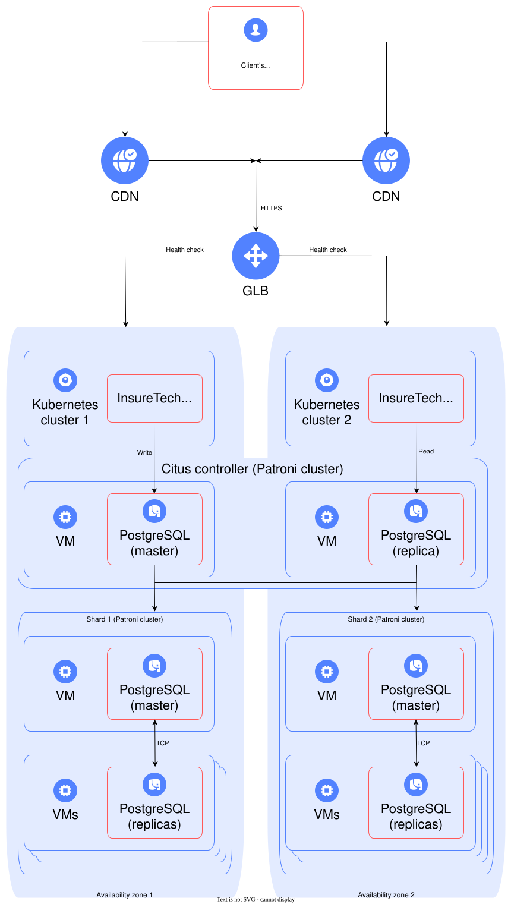

# Повышение доступности сервиса

## Context and Problem Statement

Сервис — агрегатор страховых услуг, обслуживает частных и корпоративных клиентов. Частным клиентам доступен удобный сайт для выбора и оформления страховок, корпоративным — API для интеграции в их продукты.

Проблемы:

- Медленные запросы, особенно при резком росте запросов от отдельных партнёров.
- Падение приложения во время пиковых нагрузок.
- Долгое время восстановления после сбоев, превышающее допустимые значения.

Требования:

- Отказоустойчивость: RTO — 45 минут, RPO — 15 минут.
- Доступность — 99.9%.
- Единое время отклика страниц для пользователей из разных регионов.

## Considered Options

- Active-active failover

  - Обеспечивает одинаковое время отклика в разных регионах
  - Высокая доступность
  - Значительно сложнее в реализации и синхронизации данных
  - Требует согласования данных между регионами

  Active-standby — более простой, дешевый и быстрый вариант, но может не подойти по времени отклика в разных регионах. Стоит более подбробно изучить требования к времени отклика и распределению пользователей по регионам.

- Горизонтальное автомасштабирование в Kubernetes

  - Позволяет быстро динамически добавлять/удалять инстансы при росте нагрузки
  - Требует контроля состояния приложения и корректной работы сессий

- Размещение в одном Availability Zone (AZ) с 1 кластером

  - Уменьшает риск split-brain
  - Снижает задержки из-за отсутствия распределенных нод
  - Упрощает управление и мониторинг

- Использование Patroni для HA и Citus для шардирования

  - Patroni обеспечивает высокую доступность PostgreSQL
  - Citus позволяет масштабировать БД по шардам
  - Ускоряет доступ к данным из разных регионов
  - Чтение с реплик, запись — только через мастер в одном AZ
  - Возможное узкое место при интенсивных записях
  - Необходим мониторинг распределения нагрузки чтения/записи

- CDN для статических ресурсов (например, тарифы)

  - Ускоряет доставку контента
  - Снижает нагрузку на серверы

- CQRS — отложен, т.к. нагрузка на запись не изучена

- Edge computing — не требуется, т.к. нет критичной обработки на стороне клиента

## Decision Outcome

- Active-active failover для равномерного времени отклика и высокой доступности.
- Горизонтальное автоскейлирование Kubernetes для быстрого реагирования на изменение нагрузки.
- Один AZ — один кластер, чтобы исключить split-brain и минимизировать задержки.
- Использование Patroni и Citus для HA и шардинга БД, с чтением с реплик и записью через мастера.
- Внедрение CDN для статических данных.

Целевая архитектура:

### Consequences

- Улучшится устойчивость к сбоям и нагрузкам.
- Время отклика станет стабильным для пользователей по регионам.
- Усложняется поддержка синхронизации данных в active-active failover.
- Требуется мониторинг и поддержка кластеров в разных регионах.
